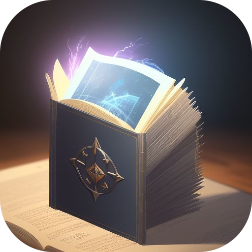

<div align="center">
  
</div>

# Kindle to References (KTR)

The idea of this utility is to convert the highlights I've made in my Kindle to a format that I can use in my Zettelkasten ([Obsidian](https://obsidian.md)).

## Installation

### Cargo

The cleanest way to install KTR is via `cargo`:

```sh
cargo install --git https://github.com/iambenzo/ktr.git --branch main ktr # for cli
cargo install --git https://github.com/iambenzo/ktr.git --branch main ktr_gui # for gui
```

Or via [cargo-packager](https://github.com/crabnebula-dev/cargo-packager) for the GUI:

```sh
cargo install cargo-packager
cargo packager --release
```

This will give you a package that you can install for your platform under `./target/release/`.

### GitHub Releases

There are [Releases](https://github.com/iambenzo/ktr/releases/latest) available. However, none of the applications are signed, which may mean you have to do some "unblocking" before you can run the apps on your machine. I haven't found this to be an issue on Linux.

#### Unblocking on Mac

Simply remove the quarantine flag that is put on the executable/dmg file:

```sh
xattr -d com.apple.quarantine <dmg_or_cli>
```

You may also need to:

```sh
chmod +x <dmg_or_cli>
```

#### Unblocking on Windows

Right-click on the `.exe` file and select "Properties". Under the "General" tab, you'll see a checkbox near the bottom of the window labelled "Unblock" - click it. Once you done that, click "Apply" and then "Okay".


## Usage

This application doesn't do anything too fancy. It takes a path to your 'My Clippings.txt' file, found on your Kindle under the `documents` directory.

You can optionally supply your own [Tera](https://github.com/Keats/tera) template if you want to deviate from the [default output](./kindle_clippings/src/templates/default.md)/structure.

Finally, you need to provide a path to a directory for the output files to land in.

The output is a set of files, one per book, containing your Kindle highlights ready for augmenting into your Zettelkasten. Any Kindle notes attached to a highlight will also be included by the default template.

### CLI

For the CLI, a default `output` directory will be created if one isn't supplied by you, the user.

The CLI will parse your entire clippings file every time.

```sh
Usage: ktr [OPTIONS] <CLIPPINGS_FILE>

Arguments:
  <CLIPPINGS_FILE>

Options:
  -t, --template <TEMPLATE_FILE>
  -o, --output <OUTPUT_DIR>
  -h, --help                      Print help
  -V, --version                   Print version
```

### GUI

The GUI is a wizard style application.

The benefit of the GUI over the CLI is that it will allow you to select which books are processed into output files...though you will have to use your mouse.

## Templating

For those of you comfortable reading a little Rust, you can take a look at [this file](./kindle_clippings/src/output.rs) to understand what objects are available to your custom template.

For those of you who like tables, here you go:

| Object | Type | Notes |
| ------ | ---- | ----- |
| date | String | Today's date, excluding time |
| highlights | Vec | An iterable list of a book's highlights |
| quotes | Vec | An iterable list of a book's quotes |

If you take a look at the [model](./kindle_clippings/src/model.rs), you'll see that there's opportunity to make more objects available for templating. If there's demand, then I could look to expand the list of available objects for templating.
